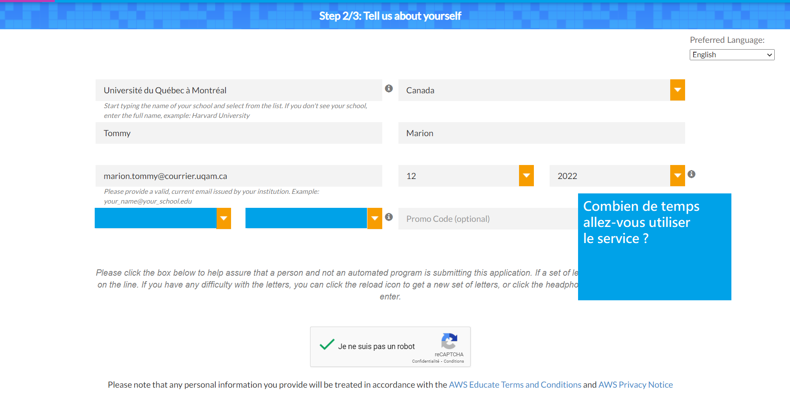
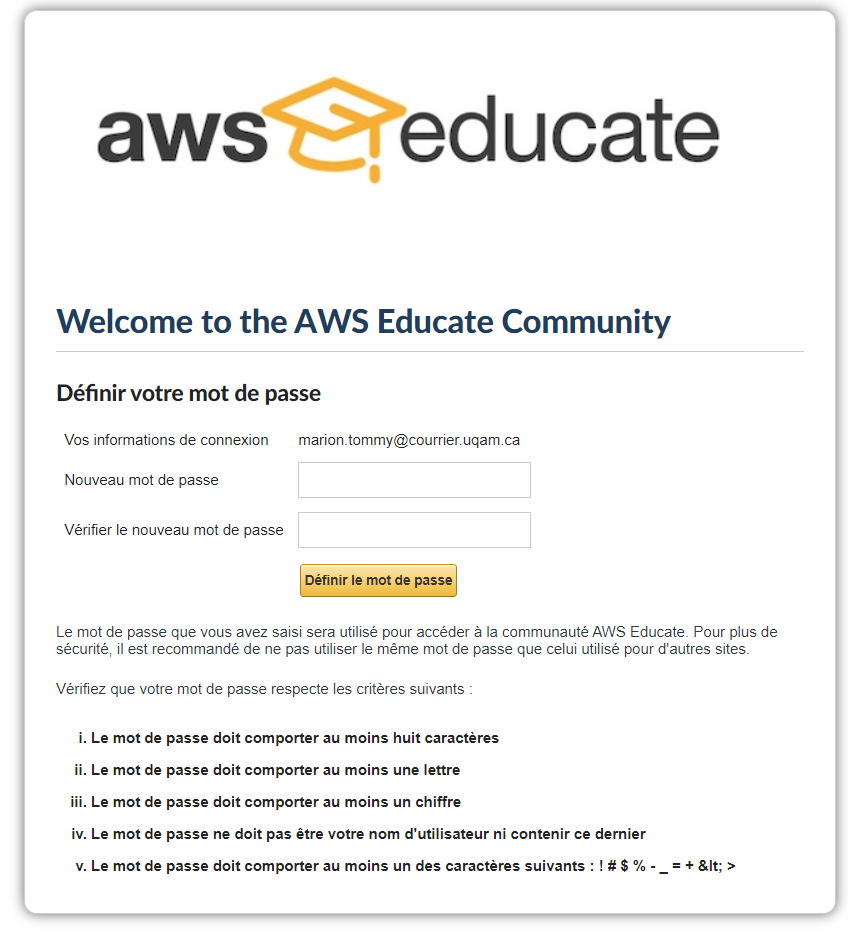

## Connection à AWS
# Inscription
1)	Entrer « aws uqam » sur google ou allez à [https://servicesinformatiques.uqam.ca/services/AWS%20Educate]
2)	Choissisez Student
3)	Complètez les 3 pages d’inscription avec votre addresse uqam( XX@courriel.uqam.ca)

---

4)	Allez dans votre courriel uqam et valider votre courriel
5)	Attendez de recevoir un 2e courriel pour que votre compte soit créé(moi ça m’a pris 10 minutes, ça peut prendre jusqu’à 2 jours)
6)	Créez votre mot de passe avec le lien qui vous a été envoyé.  

